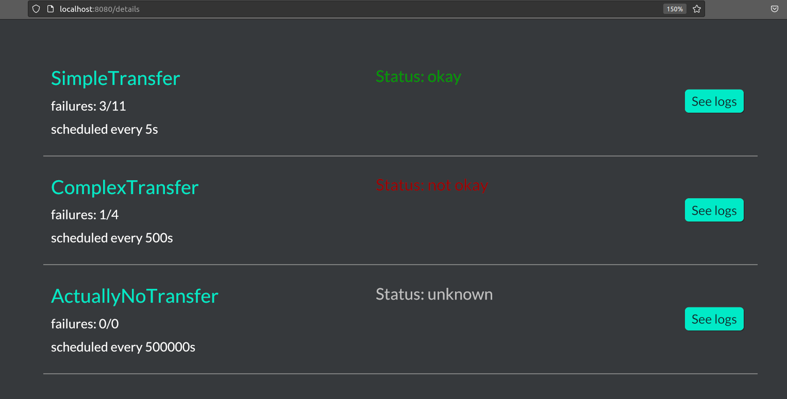
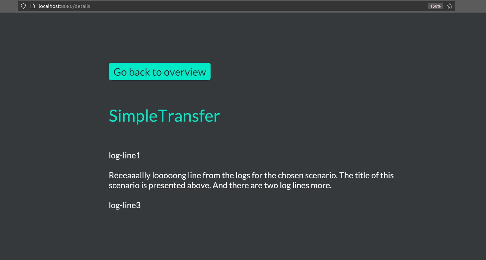

# Traffic Maker: Monitoring 👀

It is quite helpful to have immediate insight into the current statistics and status of the launched scenarios (bots).
This part of repository provides a primitive and basic overview.

## Sample glance

|        Main overview        | Logs from a single bot  |
|:---------------------------:|:-----------------------:|
|  |  |

## What framework do we use?

The code uses mainly `iced` framework (see: https://iced.rs/). It is neither most popular Rust frontend library nor 
is very stable, but it has some advantages:
 - it is extremely simple
 - you write 100% Rust code without any unholy macros (like `yew`'s `html!`) or inline tags
 - is under active development, so there is a  hope for enhancements and support
 - can be quite pleasant to look at after some (not a lot of) work with styles (also in pure Rust, no (s)css needed) -- see for yourself by looking at their examples 
 - for web development it builds WebAssembly runtime on top, which is compatible with the recent trends and tools (like `trunk`)

We use here the latest (as for now) code from their main branch (the newest release is quite old).

## Installation and launching

Just by running `cargo run -p traffic-maker-monitoring` you should observe a new window opened with the application. 
This is quite okay for local purposes, but we rather need something viewable in a browser. 
For that we use `trunk` (see https://trunkrs.dev/). You can install it with cargo (`cargo install --locked trunk`).

What does `trunk` do? In brief, it looks at `index.html`, does some preprocessing, builds the Rust target, builds the `dist` directory,
tangles all the `wasm` products with some hellish js magic and serves the frontend as a single-page web service. 
And you launch it with `trunk serve` (by default it will serve at `localhost:8080`).

Alternatively (however not recommended), you can avoid using `trunk` and instead work only with `iced`. 
This is described in details here: https://github.com/iced-rs/iced_web.
Most probably installing `trunk` will take you less time.

## Launching in production

To launch optimized version, run
```
trunk serve --release
```
